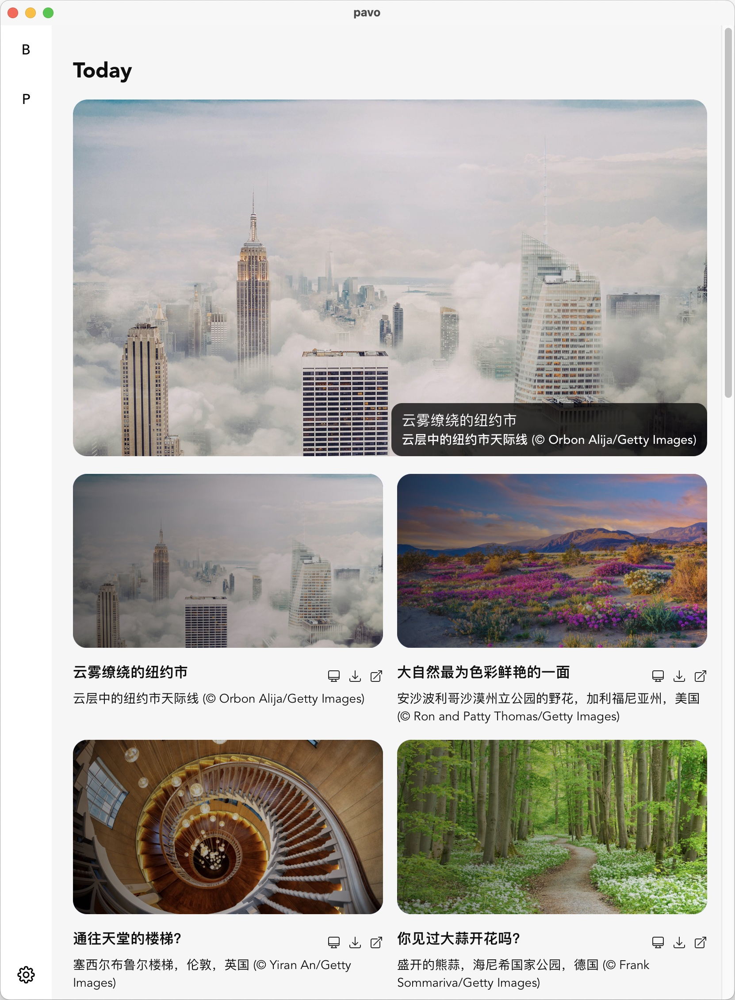

<p align="center">
  
</p>
<h1 align="center">Pavo</h1>

A wallpaper application.

## Screenshot

<p align="center">

</p>

## How to develop

### install dependencies

```shell
rustup upgrade

cargo install tauri-cli
cargo install trunk

rustup target add wasm32-unknown-unknown
```

### start dev server

```shell
cargo tauri dev
```
