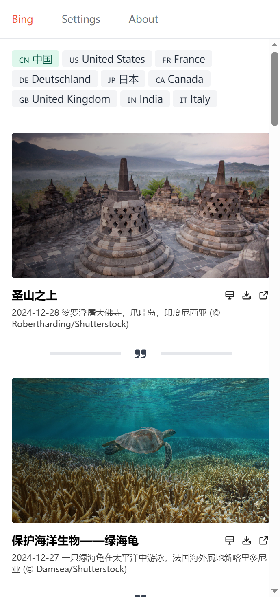

<p align="center">
  
</p>
<h1 align="center">Pavo</h1>

A wallpaper application.

## Screenshot

<p align="center">

</p>

## Get Started

### Prerequisites

* Install Node.js. I recommend you to use [NVM](https://github.com/nvm-sh/nvm).
* Install pnpm. [Here](https://pnpm.io/installation) is the manual.
* Install Rust. You can find way in [here](https://www.rust-lang.org/tools/install)
* Follow the [Tauri setup guide](https://tauri.app/v1/guides/getting-started/prerequisites)
* Run pnpm install

### Develop and Build

It is easy to start developing

```bash
pnpm tauri dev
```

And also easy to build.

```bash
pnpm tauri build
```

You can get more details about building Tauri app in [here](https://tauri.app/v1/guides/distribution/publishing)

## Repo Activuty


### More Projects

* [Lettura: Another free and open-source feed reader for macOS and Window.. ](https://github.com/zhanglun/lettura)
* [BookWise: book wise, read wiser](https://github.com/zhanglun/bookwise)
