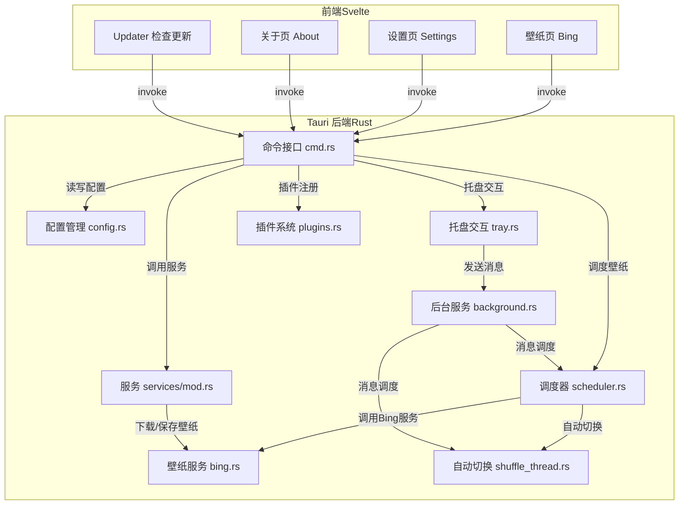

# Pavo 项目架构设计

Pavo 是一款基于 Tauri 的跨平台桌面壁纸应用，采用前后端分离架构，前端使用 Svelte，后端核心逻辑用 Rust 实现。

## 架构总览

## 说明
- **前端（Svelte）**：负责 UI 展示和用户交互，通过 Tauri invoke 与后端通信。
- **Tauri 后端（Rust）**：实现所有业务逻辑，包括配置管理、壁纸调度、后台服务、托盘菜单、插件注册、壁纸下载与切换等。
- **核心流程**：
  1. 前端页面通过 invoke 调用后端命令（如获取壁纸列表、设置、关于等）。
  2. 后端命令分发到对应模块（如 scheduler、services、config）。
  3. 调度器负责壁纸的获取、缓存、切换，支持自动定时切换（shuffle_thread）。
  4. 托盘菜单和后台服务通过消息通道与调度器联动，实现快捷操作和自动化。
  5. 插件系统用于扩展功能，如日志、更新、文件系统等。

---
