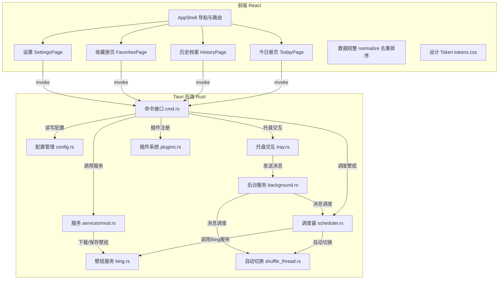

# Pavo 项目架构设计

Pavo 是一款基于 Tauri v2 的跨平台桌面壁纸应用，采用前后端分离架构。前端使用 React 19，后端核心逻辑用 Rust 实现。

## 技术栈

- **前端**：React 19 + TypeScript + Vite，CSS Modules + 全局设计 Token（OKLCH 色彩系统）
- **后端**：Rust + Tauri v2
- **分层**：FSD-Lite（app / pages / entities / features / shared）

## 架构总览


```mermaid
graph TD
  subgraph 前端 React
    APP[AppShell 导航与路由]
    TODAY[今日册页 TodayPage]
    HISTORY[历史档案 HistoryPage]
    FAV[收藏册页 FavoritesPage]
    SETTINGS[设置 SettingsPage]
    NORM[数据规整 normalize 去重排序]
    TPL[设计 Token tokens.css]
  end
  subgraph Tauri 后端 Rust
    CMD[命令接口 cmd.rs]
    CONF[配置管理 config.rs]
    SCHED[调度器 scheduler.rs]
    BG[后台服务 background.rs]
    TRAY[托盘交互 tray.rs]
    PLUG[插件系统 plugins.rs]
    SVCS[服务 services/mod.rs]
    BING[壁纸服务 bing.rs]
    SHUFFLE[自动切换 shuffle_thread.rs]
  end
  APP-->TODAY
  APP-->HISTORY
  APP-->FAV
  APP-->SETTINGS
  TODAY--invoke-->CMD
  HISTORY--invoke-->CMD
  FAV--invoke-->CMD
  SETTINGS--invoke-->CMD
  CMD--读写配置-->CONF
  CMD--调度壁纸-->SCHED
  CMD--调用服务-->SVCS
  CMD--托盘交互-->TRAY
  CMD--插件注册-->PLUG
  SCHED--调用Bing服务-->BING
  SCHED--自动切换-->SHUFFLE
  BG--消息调度-->SCHED
  BG--消息调度-->SHUFFLE
  SVCS--下载/保存壁纸-->BING
  TRAY--发送消息-->BG
```

## 前端分层（FSD-Lite）

```
src/
├── app/           应用外壳、导航、全局事件
│   ├── App.tsx
│   ├── AppShell.tsx          今日/历史/收藏/设置 路由 + 顶栏
│   └── useTauriEvents.ts     托盘与系统事件接入
├── pages/         页面
│   ├── today/                每日册页主视觉
│   ├── history/              按日期归档的历史档案
│   ├── favorites/            双列私人收藏册页
│   └── settings/             三档主题与全部配置
├── entities/      领域模型
│   ├── wallpaper/            类型、规整（normalize）、地区选择
│   └── settings/             配置类型与可选值
├── features/      业务动作
│   ├── favorite/             收藏增删与同步
│   ├── set-wallpaper/        设为桌面
│   ├── download/             下载原图
│   └── theme/                主题偏好与防闪启动
└── shared/        基础设施
    ├── tauri/                Tauri command 统一封装
    ├── platform/             自动更新、自启、窗口、shell
    ├── ui/                   Toast、Tooltip、Menu、EmptyState
    ├── styles/               tokens.css（OKLCH）+ global.css
    └── utils/                日期格式化
```

## 说明

- **前端（React）**：负责 UI 展示和用户交互，通过 `shared/tauri/client.ts` 统一封装的 invoke 与后端通信。数据规整集中在 `entities/wallpaper/model/normalize.ts`，按稳定标识多层去重，避免跨地区与跨日期重复展示。
- **Tauri 后端（Rust）**：实现所有业务逻辑，包括配置管理、壁纸调度、后台服务、托盘菜单、插件注册、壁纸下载与切换等。
- **核心流程**：
  1. 前端页面通过封装的 client 调用后端命令（获取今日/近期壁纸、收藏、配置等）。
  2. 后端命令分发到对应模块（scheduler、services、config）。
  3. 调度器负责壁纸的获取、缓存、切换，支持自动定时切换（shuffle_thread）。
  4. 托盘菜单和后台服务通过消息通道与调度器联动，实现快捷操作和自动化。
  5. 插件系统用于扩展功能，如日志、更新、文件系统等。
- **主题**：三档（跟随系统 / 浅色 / 深色），偏好持久化在 localStorage，`index.html` 内联脚本在 React 挂载前同步应用，减少启动闪烁。

---
